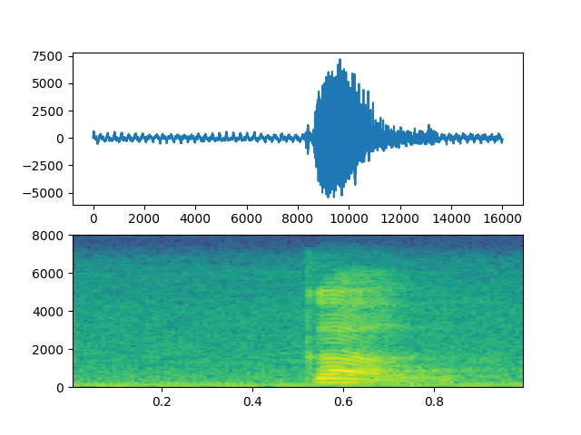
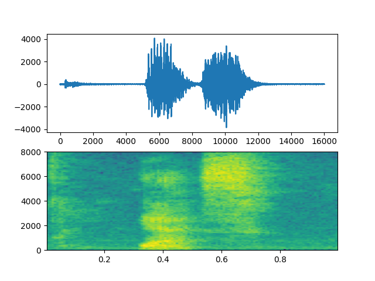
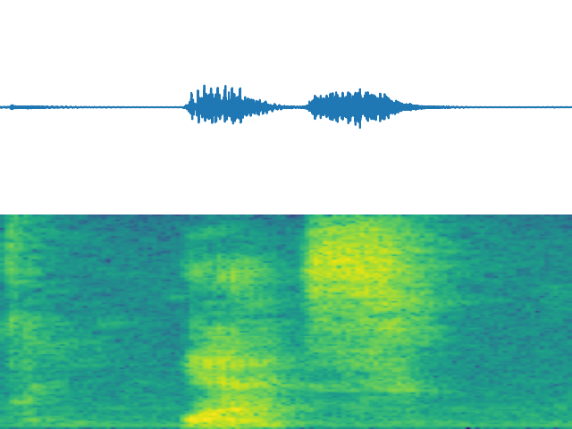
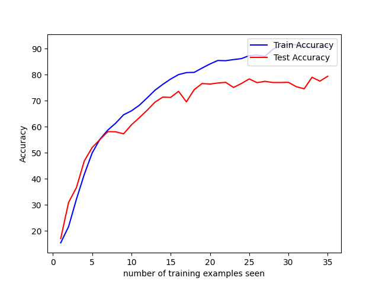

# DEMO: Speech Commands Recognition

#### Disclaimer
This repository is a demo file.<br>
It's only purpose is to archive my tests.<br>
Please do not consider it as a project.<br>

However, feel free to send any pull request.

## Summary:

The main purpose of this demo is to work with audio files in machin learning.<br>
So I decided to create a model to recognize a few spoken commands.

Here is a [link](https://arxiv.org/abs/1804.03209) to the dataset I used.

## Workflow:


#### Preprocessing
The fist question I asked my self was: How to feed these audios of different duration into the model ?<br>
So I decided to transform them into something I am familiar with: images.

I created two graphes for each wav file using `wavfile` and `matplotlib`:

Result for an audio file saying "go":<br>
<br>
Result for an audio file saying "yes":<br>


But as you can see there still two issues:
1) All images does not have the same scale
2) There is a lot of blank space between each graph.

To solve the first issue I used `plt.xlim()`, `plt.ylim()` and `plt.axis('off')` to set the same scale for all images.<br>
To solve the second issue I used those few lines wich I founded on StackOverflow:
```py
def setUpPlot_noBlankSpace():
    plt.gca().set_axis_off()
    plt.subplots_adjust(top=1, bottom=0, right=1, left=0, hspace=0, wspace=0)
    plt.margins(0,0)
    plt.gca().xaxis.set_major_locator(plt.NullLocator())
    plt.gca().yaxis.set_major_locator(plt.NullLocator())
```
(NB: you can find those code in `dataset_loader.py`)

Now I have an image like this almost ready to be fit:<br>


#### Model
The next step is to crete the Neural Network.

I used a Simple Convolutional Neural Network.<br>
[Source code](https://github.com/Thytu/miniSpeechCommands_Recognition/conv2d.py):
```py
class CNN(nn.Module):
    def __init__(self):
        super().__init__()
        self.conv1 = nn.Conv2d(in_channels=4, out_channels=6, kernel_size=3)
        self.conv2 = nn.Conv2d(in_channels=6, out_channels=12, kernel_size=3)
        self.conv3 = nn.Conv2d(in_channels=12, out_channels=24, kernel_size=3)
        self.fc1 = nn.Linear(24 * 6 * 6, 200)
        self.fc2 = nn.Linear(200, 50)
        self.out = nn.Linear(50, 8)

    def forward(self, t):
        t = self.conv1(t)
        t = F.max_pool2d(t, kernel_size=2, stride=2)
        t = F.relu(t)

        t = self.conv2(t)
        t = F.max_pool2d(t, kernel_size=2, stride=2)
        t = F.relu(t)

        t = self.conv3(t)
        t = F.max_pool2d(t, kernel_size=2, stride=2)
        t = F.relu(t)

        t = t.reshape(-1, 24 * 6 * 6)

        t = self.fc1(t)
        t = F.relu(t)

        t = self.fc2(t)
        t = F.relu(t)

        t = self.out(t)

        return t
```

#### Results


<code>BATCH_SIZE = 128</code>
<code>LEARNING_RATE = 0.001</code>
<code>optimizer = Adam</code>
<code>loss_function = F.cross_entropy<br></code>

